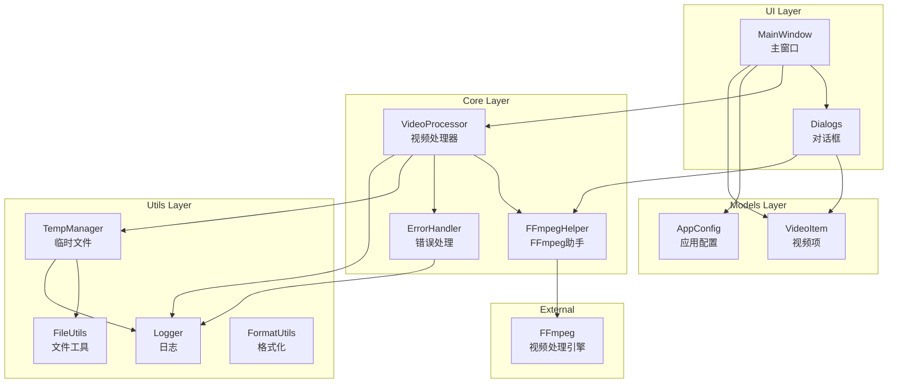
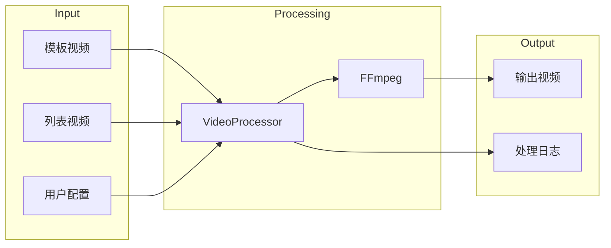
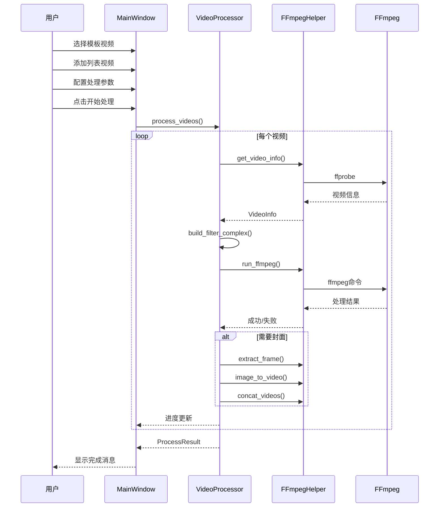
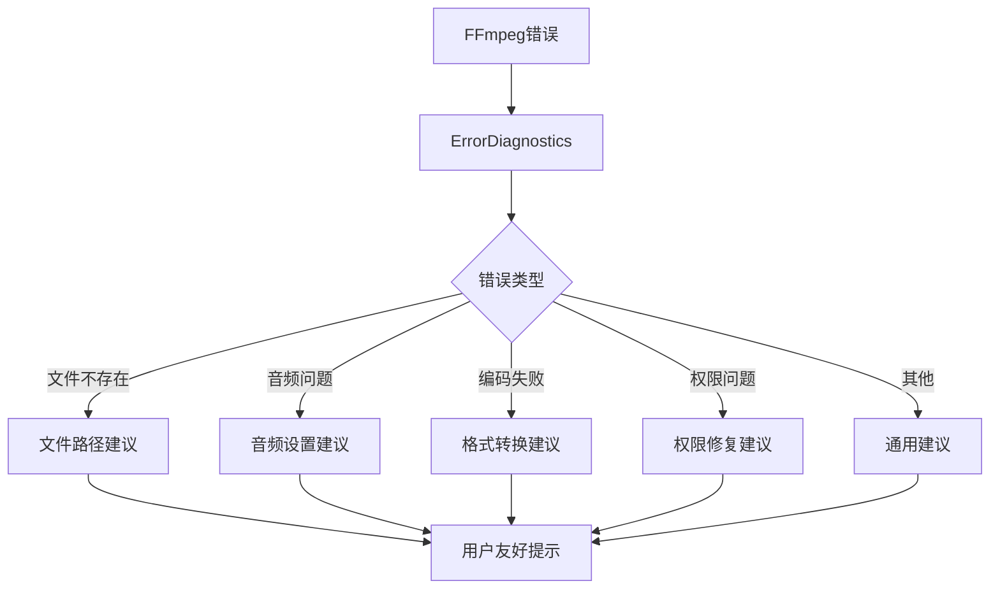

# 视频分割拼接工具 - 架构文档

## 项目概述

视频分割拼接工具（Video Pin）是一个基于 Python + Tkinter + FFmpeg 的桌面应用程序，用于将两个视频按照指定方式分割并拼接。

## 目录结构

```
video_pin/
├── src/                          # 源代码目录
│   ├── __init__.py              # 包初始化
│   ├── app.py                   # 应用入口
│   ├── models/                  # 数据模型层
│   │   ├── __init__.py
│   │   ├── video_item.py        # 视频项数据结构
│   │   └── config.py            # 应用配置
│   ├── core/                    # 核心业务层
│   │   ├── __init__.py
│   │   ├── ffmpeg_utils.py      # FFmpeg 工具类
│   │   ├── video_processor.py   # 视频处理器
│   │   └── error_handler.py     # 错误处理
│   ├── ui/                      # UI界面层
│   │   ├── __init__.py
│   │   ├── main_window.py       # 主窗口
│   │   └── dialogs.py           # 对话框组件
│   └── utils/                   # 工具函数层
│       ├── __init__.py
│       ├── file_utils.py        # 文件操作
│       ├── format_utils.py      # 格式化工具
│       ├── logger.py            # 日志系统
│       └── temp_manager.py      # 临时文件管理
├── main.py                      # 原始入口（保留兼容）
├── docs/                        # 文档目录
└── tests/                       # 测试目录
```

## 架构分层



## 数据流程图



## 视频处理流程



## 核心类说明

### 1. VideoProcessor (视频处理器)

主要职责：
- 协调整个视频处理流程
- 构建 FFmpeg filter_complex
- 处理封面添加
- 进度报告

```python
class VideoProcessor:
    def process_videos(...) -> ProcessResult
    def _build_filter_complex(...) -> str
    def _add_cover_to_video(...) -> ProcessResult
```

### 2. FFmpegHelper (FFmpeg助手)

主要职责：
- 封装所有 FFmpeg/FFprobe 调用
- 获取视频信息
- 提取帧
- 图片转视频

```python
class FFmpegHelper:
    @staticmethod
    def get_video_info(path) -> VideoInfo
    @staticmethod
    def extract_frame(video, output, time) -> bool
    @staticmethod
    def image_to_video(image, output, duration) -> bool
```

### 3. VideoItem (视频项)

数据模型，包含：
- 视频路径
- 分割比例
- 缩放百分比
- 封面设置

### 4. AppConfig (应用配置)

全局配置，包含：
- 分割模式
- 位置顺序
- 音频来源
- 输出设置

## 分割拼接模式

### 水平分割（左右）

```
模板视频:          列表视频:
┌─────┬─────┐     ┌─────┬─────┐
│  A  │  B  │     │  C  │  D  │
└─────┴─────┘     └─────┴─────┘

拼接模式:
- A+C: 模板左 + 列表左
- A+D: 模板左 + 列表右
- B+C: 模板右 + 列表左
- B+D: 模板右 + 列表右
```

### 垂直分割（上下）

```
模板视频:          列表视频:
┌─────────┐       ┌─────────┐
│    A    │       │    C    │
├─────────┤       ├─────────┤
│    B    │       │    D    │
└─────────┘       └─────────┘
```

## 错误处理机制



## 技术栈

| 组件 | 技术 | 版本 |
|------|------|------|
| GUI框架 | Tkinter | Python内置 |
| 视频处理 | FFmpeg | 4.x+ |
| 图片处理 | Pillow | 9.x+ |
| 打包工具 | PyInstaller | 5.x+ |

## 扩展点

1. **新增拼接模式**: 在 `VideoProcessor._build_filter_complex()` 中添加
2. **新增视频参数**: 在 `VideoItem` 数据类中扩展
3. **新增对话框**: 在 `src/ui/dialogs.py` 中添加
4. **新增工具函数**: 在 `src/utils/` 中添加相应模块
